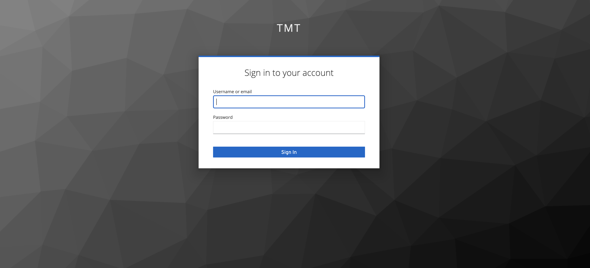

# Creating Gateway UI Application

This flow demonstrates how to use the template to create our project, how to add UI components for adding particular features,
and how to build and test it.

## Generate Application

First we need to generate a scaffolding application using our giter8 template:

```bash
g8 tmtsoftware/esw-gateway-ui-template.g8 --project_name=sample
```

This will generate a sample folder with `docs` and `src` folders.  For a sanity check, let's go ahead and
build the frontend created by the template.  This will also help ensure you have the necessary tools installed.

### Compile the Frontend

The `sample/src` sub-folder is where your frontend application is located.  It uses Typescript, React and node.
Make sure node version `v22.15.1` and npm 10.9.2 or higher are installed on your machine. Let's compile our generated application.

```bash
cd sample
npm install
npm start
```

You will be greeted with the following screen.


@@@ note
This tutorial uses the current ESW.UISTD selections for user interface languages, libraries, and tools. These selections
will be reviewed and updated once again as part of ESW Phase 2.
@@@

## Open in Development Environment

At this point, you may want to open the project in an Integrated Development Environment (IDE), such as Intellij,
if you are using one.  The template creates a Typescript/npm-based frontend. We recommend VS Code or Intellij.

To open the UI project in VS Code, click on `File->Open`. To open the UI project in Intellij, click on `File->New Project from Existing Sources`

Then browse to the UI directory, open the `sample` project.  It should have a package.json file in it.

## Create the UI

In this section, we will begin constructing our browser-based UI using React components in Typescript. We will start by
adding a login component.

@@@ note
The frontend tutorial uses functionality from the ESW-TS library.  The documentation for ESW-TS can be useful when
building your UI.  ESW-TS documentation can be found [here](http://tmtsoftware.github.io/esw-ts).
@@@

### Create login component

Use of the TMT Command Service via the UI Gateway requires authentication.  The user must login via the TMT AAS login
page, so we will add a login component from the ESW-TS library.  Create a `Login.tsx` file in the `src/components` folder
which will redirect the user to the TMT login page. Later we will use this `Login` Component in `Main.tsx`.

Copy the full snippet shown below & paste it in Login.tsx

Typescript
: @@snip [Login.tsx](../../../../src/components/Login.tsx) { #login-page }

### Update Main & App component with authentication

First, add the component to our UI by updating the `Main.tsx` component in `/src/components`.

Copy the full snippet shown below and replace the contents in `Main.tsx`.

Typescript
: @@snip [Main.tsx](../../../../src/components/Main.tsx) { #auth }

Here, you will see that there is a check to see if the user is authenticated, and if not, the login component will be
shown.  If the user is authenticated, the normal functionality of the app is presented, which right now, is just the
Hello World page.

In order for our main component to have access to authentication logic from ESW-TS, we need to add a
[context provider](https://reactjs.org/docs/context.html) to the component.  We do this when the component is constructed
at the top level.  We will wrap our Main application with `AuthContextProvider` from `esw-ts` in `App.tsx`
as shown below

Copy the snippet within the `return` statement from the following & update `App.tsx`.

Typescript
: @@snip [App.tsx](../../../../src/App.tsx) { #auth-context }

After adding this section, run the following command to see the progress that we made till now.

```bash
npm start
```

You should now see `Loading...` on the browser screen.


This is because the UI is now trying to find the AAS authorization server, but we have not yet started CSW services.
We will start them now, as well as the UI Gateway which will be needed for our subsequent flows.

## Starting backend services

Start the Location Service with the Authorization and Authentication Service, Config Service & the Event Service.

```bash
cs install csw-services
csw-services start -k -c -e
```

Start the UI Gateway Service using esw-services.

```bash
cs install esw-services
esw-services start start-eng-ui-services

```

Now try reloading the front end in browser.  If the page is still up, refresh the page.  If you closed it, restart the
server using:

```bash
npm start
```

You should be getting redirected to keycloak login page.



Try logging in with one of predefined users in csw-services.

Visit [here](https://tmtsoftware.github.io/csw/$csw-version$/apps/cswservices.html#predefined-users-) to find the predefined users.

Visit [here](https://tmtsoftware.github.io/esw/$esw-version$/uisupport/gateway.html) to know more about users & the roles.

Once you are logged in, you would be greeted again with `Hello world`.

Now, we can make use of authorization data to send a request to a protected route of the Gateway server.

### Cleanup

We can get rid of the unwanted css generated from the template:

* Go to the `components` folder in `src` and delete `Main.module.css` file in this directory

### Next Steps

* Follow the tutorial @ref:[here](./submit-commands.md) to add the Submit Command functionality.
* Follow the tutorial @ref:[here](./subscribe-event.md) to add the Subscribe Event functionality.
