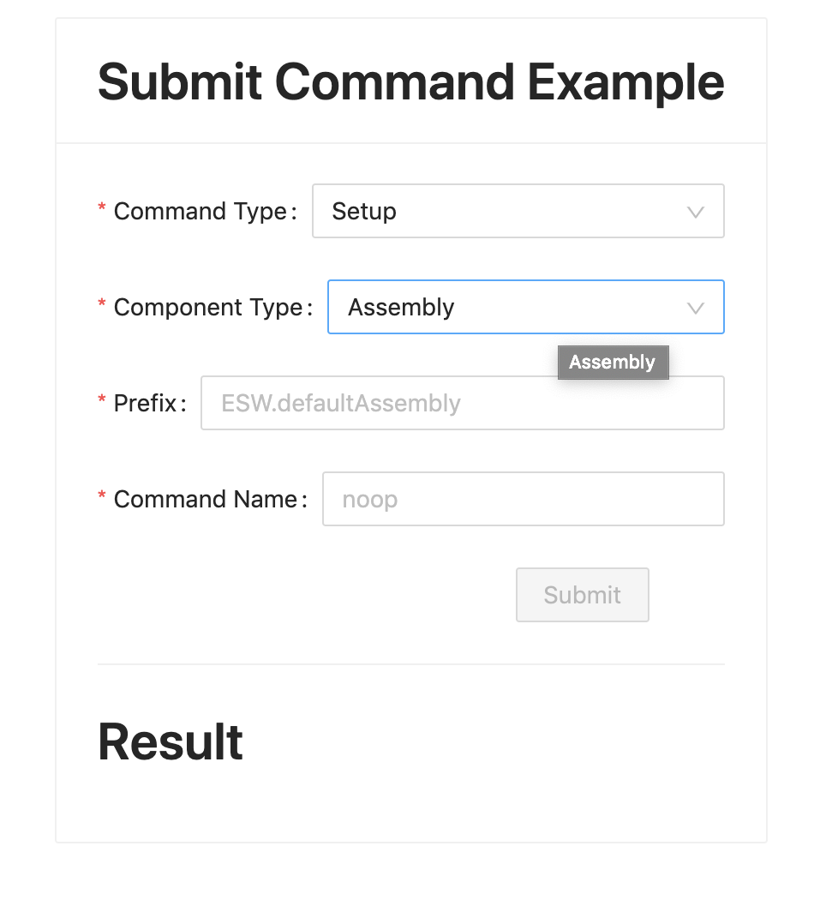

# Adding Submit Command Example

In this use case, we want to send a command (Setup/Observe) to an Assembly/HCD from the UI application via Gateway server.

Visit [here](https://tmtsoftware.github.io/csw/0.1.0-SNAPSHOT/params/commands.html) to learn more about commands.

Visit [here](https://tmtsoftware.github.io/csw/0.1.0-SNAPSHOT/commons/create-component.html) to learn more about Assembly / HCD components.

## Start an Assembly using esw-shell

First, lets install esw-shell utility which renders ammonite shell with basic api's for us to orchestrate the backend services.

```bash
cs install esw-shell:0.3.0-RC1
esw-shell start 
@                 // you are inside ammonite shell now
```

Visit [here](https://tmtsoftware.github.io/esw/0.1.0-SNAPSHOT/eswshell/esw-shell.html) to learn more about the esw-shell utility.

we are using [this](https://tmtsoftware.github.io/esw/0.1.0-SNAPSHOT/eswshell/esw-shell.html#using-custom-component-handlers) API to start our assembly with our custom handlers.

This assembly takes `sleep` command with `sleepInSeconds` (LongKey) parameter and returns `Started Response` immediately and then `Completed response` after the given sleep value.
Any other command other than `sleep` returns Completed Response.

Run this command inside esw-shell's ammonite shell:

```bash
spawnAssemblyWithHandler(
      "ESW.defaultAssembly",
      (ctx, cswCtx) =>
        new DefaultComponentHandlers(ctx, cswCtx) {
          override def onSubmit(runId: Id, controlCommand: ControlCommand): CommandResponse.SubmitResponse = {
            controlCommand.commandName.name match {
              case "sleep" =>
                val defaultSleepParam = LongKey.make("sleepInSeconds").set(5)
                val sleepParam = controlCommand.paramType.get("sleepInSeconds", LongKey).getOrElse(defaultSleepParam)
                cswCtx.timeServiceScheduler.scheduleOnce(UTCTime(UTCTime.now().value.plusSeconds(sleepParam.value(0)))) {
                  cswCtx.commandResponseManager.updateCommand(CommandResponse.Completed(runId))
                }
                CommandResponse.Started(runId)
              case _ => CommandResponse.Completed(runId)
            }
          }
        }
    )
```

This should start an assembly with prefix `ESW.defaultAssembly`.

## Add Submit Command component

Add `SubmitCommand.tsx` in `src/components` folder.

SubmitCommand.tsx looks like following:

@@@note
You can refer the source code of the completed application at any point in the course of this tutorial.
You can find it [here](https:github.com/tmtsoftware/esw-ui-example)
@@@

Typescript
: @@snip [SubmitCommand.tsx](../../../../src/components/SubmitCommand.tsx) { #submit-command }

Add appropriate imports to the file.

Typescript
: @@snip [SubmitCommand.tsx](../../../../src/components/SubmitCommand.tsx) { #submit-command-imports }

Let's add the Form component's for the input fields.

1. CommandType - A Selectable with Options(Setup/Observe)
1. ComponentType - A Selectable with Options(Assembly/HCD)
1. Prefix - A Text Input (user to put Appropriate Prefix of earlier Started Assembly)
1. Command - A Text Input (user to put command `sleep` or anything else)
1. Sleep - A Optional field visible only when command is `sleep`.
1. Submit - A Button to submit command.

Typescript
: @@snip [SubmitCommand.tsx](../../../../src/components/SubmitCommand.tsx) { #submit-command-form }

Add the following react states to hold the information of their corresponding user inputs.

Typescript
: @@snip [SubmitCommand.tsx](../../../../src/components/SubmitCommand.tsx) { #submit-command-states }

Now finally, add the `submit` action to be called on Submit button click(i.e. `onFinish` handle of Form component)

Typescript
: @@snip [SubmitCommand.tsx](../../../../src/components/SubmitCommand.tsx) { #submit-action }

## Render SubmitCommand result's

Add this helper function to render color corresponding to the SubmitResponse's type.

Tip: this function can be defined outside component because it is independent of any component state.

Typescript
: @@snip [SubmitCommand.tsx](../../../../src/components/SubmitCommand.tsx) { #color-helper }

## Integrate SubmitCommand Component

Finally, update Main.tsx to include `SubmitCommand` component.

Typescript
: @@snip [Main.tsx](../../../../src/components/Main.tsx) { #submit-command }

UI should render the following view at this moment.



Fill in the values for all input fields and submit.

```text
prefix : ESW.defaultAssembly
command : sleep
sleep : 2
```

That's all for adding an Submit command feature!!!
