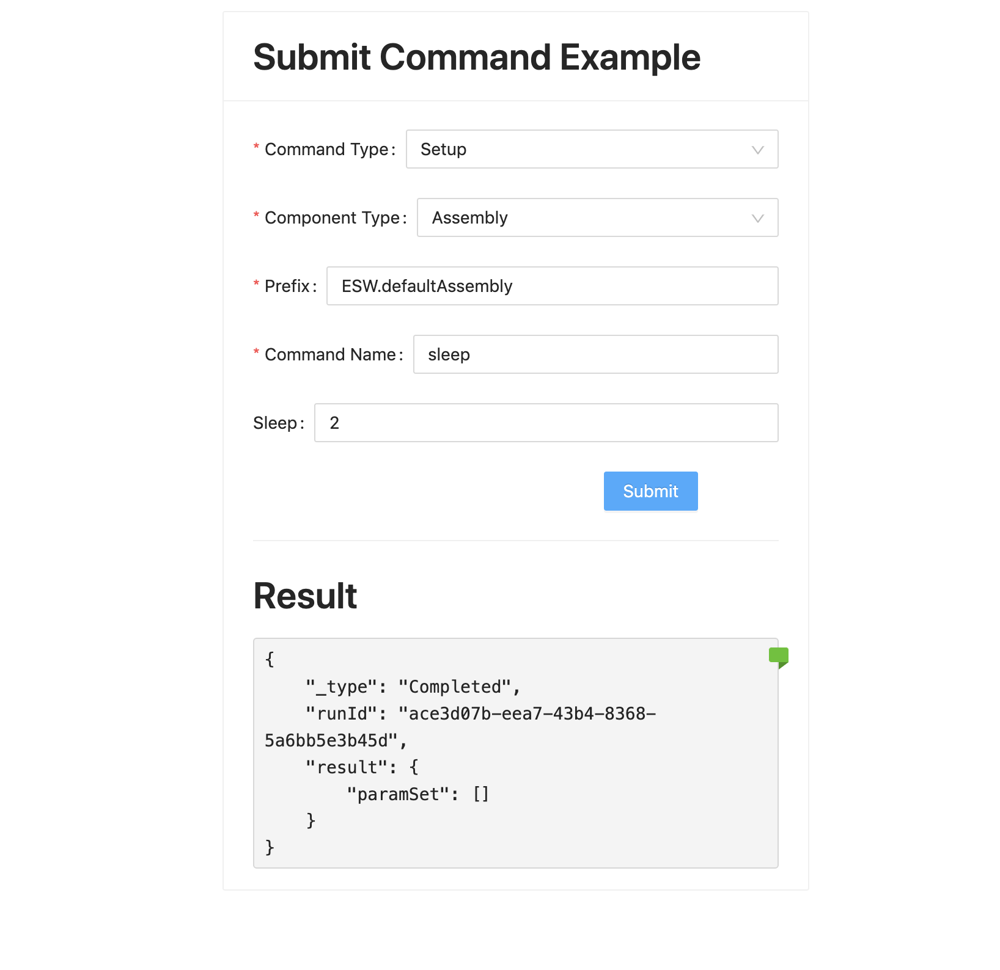

# Adding a Submit Command

In this part of the tutorial, we want to send a Setup Command to an Assembly from the UI application via Gateway server.

Visit [here](https://tmtsoftware.github.io/csw/$csw-version$/params/commands.html) to learn more about commands.

Visit [here](https://tmtsoftware.github.io/csw/$csw-version$/commons/create-component.html) to learn more about components.

## Start an Assembly using esw-shell

We will use the esw-shell utility to create and start a simple Assembly. The esw-shell is a REPL application that provides
numerous tools for TMT programming.  Visit [here](https://tmtsoftware.github.io/esw/$esw-version$/eswshell/esw-shell.html)
to learn more about the esw-shell utility.

```bash
cs install esw-shell
esw-shell start
@                 // you are inside ammonite repl now
```

We will use an esw-shell
[feature](https://tmtsoftware.github.io/esw/$esw-version$/technical/apps/esw-shell.html#using-custom-component-handlers)
that allows the dynamic creation of component by specifying command handler functionality when spawning the component.

Our assembly will take a `sleep` command with `sleepInSeconds` (LongKey) parameter.  This is a long-running command
which will return a `Started` response immediately and then a `Completed` response after sleeping the time provided
in the parameter. Any other command other than `sleep` immediately returns a `Completed` response.

Run this command inside esw-shell's ammonite shell:

```bash
spawnAssemblyWithHandler(
      "ESW.defaultAssembly",
      (ctx, cswCtx) =>
        new DefaultComponentHandlers(ctx, cswCtx) {
          override def onSubmit(runId: Id, controlCommand: ControlCommand): CommandResponse.SubmitResponse = {
            controlCommand.commandName.name match {
              case "sleep" =>
                val defaultSleepParam = LongKey.make("sleepInSeconds").set(5)
                val sleepParam = controlCommand.paramType.get("sleepInSeconds", LongKey).getOrElse(defaultSleepParam)
                cswCtx.timeServiceScheduler.scheduleOnce(UTCTime(UTCTime.now().value.plusSeconds(sleepParam.value(0)))) {
                  cswCtx.commandResponseManager.updateCommand(CommandResponse.Completed(runId))
                }
                CommandResponse.Started(runId)
              case _ => CommandResponse.Completed(runId)
            }
          }
        }
    )
```

This should start an assembly with prefix `ESW.defaultAssembly`.

## Add Submit Command Component

Assuming that you have followed the @ref:[basic flow](./base-flow.md), we can go further and add functionality to the
UI to submit a command to our assembly.

Create the file `SubmitCommand.tsx` in the `src/components` folder.

Copy the following code into `SubmitCommand.tsx`:

Typescript
: @@snip [SubmitCommand.tsx](../../../../src/components/SubmitCommand.tsx) { #submit-command }

There is a lot to unpack here, so we will describe the code in sections.

Within the return statement, we specify a `<Card>` component to be the root component of our form.  Here we provide
some styling as well as titles for our sections, and a section at the bottom to display the result.
The form for composing the command in encoded in a `<Form>` component.  Within it, we have the following components:

* CommandType - A Selectable with Options(Setup/Observe)
* ComponentType - A Selectable with Options(Assembly/HCD)
* Prefix - A Text Input (user to put Appropriate Prefix of our Assembly)
* Command - A Text Input (user to put command `sleep` or anything else)
* Sleep - A Optional field visible only when command is `sleep` (Time to sleep in seconds).
* Submit - A Button to submit command.

In the definition of the `SubmitCommand` object near the top of the file, we define React
[state hooks](https://reactjs.org/docs/hooks-state.html) to store the values specified in our form.

Typescript
: @@snip [SubmitCommand.tsx](../../../../src/components/SubmitCommand.tsx) { #submit-command-states }

The definition of each state specifies a tuple that gives the name of variable to hold the value, and the name of the
setter method for that state variable.  These are used in each corresponding Form component in the `value`
and `onChange` attributes.

Next, note the `submit` method defined after the command state hooks.  This defines the action to be called when the
Submit button is clicked.  This is linked to the Button component in the `onFinish` attribute.

Typescript
: @@snip [SubmitCommand.tsx](../../../../src/components/SubmitCommand.tsx) { #submit-action }

This method makes use of the [Command Service](https://tmtsoftware.github.io/esw-ts/services/command-service.html)
Typescript client which provides access to the Command Service routes in the Gateway.  It constructs the appropriate command
from the form and submits it to the Assembly as specified by the Prefix field.  It then gets the results and calls the
`SetResult` state hook setter.  This causes the result to be displayed in the result component,
which we defined at the bottom of the Card component:

Typescript
: @@snip [SubmitCommand.tsx](../../../../src/components/SubmitCommand.tsx) { #submit-command-result }


We provide additional functionality to help track result status by color coding a small flag in result component based
on its type.  Note that the color of the flag depends on the evaluation of a method we define at the top of the file, which
returns the appropriate color based on the result type.  This function goes outside of the component because it is
independent of React component's state.

Typescript
: @@snip [SubmitCommand.tsx](../../../../src/components/SubmitCommand.tsx) { #color-helper }


## Integrate SubmitCommand Component

Finally, update Main.tsx to include `SubmitCommand` component.

Replace the Hello World text with our component, `<SubmitCommand />`, below `div`'s style tag, and add the necessary
import.

Typescript
: @@snip [Main.tsx](../../../../src/components/Main.tsx) { #submit-command }

UI should render the following view at this moment.


Fill in the values for all input fields and submit.

```text
prefix : ESW.defaultAssembly
command : sleep
sleep : 2
```

The UI should be updated with the following results.

First the UI receives `Started` response.


And after 2 seconds, the `Completed` response is received.



* Follow the tutorial @ref:[here](./subscribe-event.md) to add the Subscribe Event functionality.
