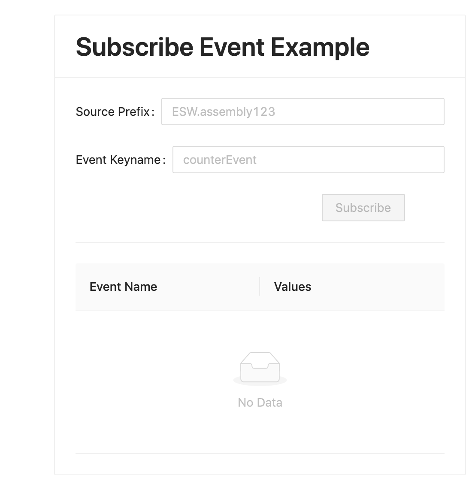

# Adding Event Subscription

In this part of the tutorial, we want to add the ability to subscribe to an Event published through the Event Service
and display the results. We will be using the esw-shell utility to publish a SystemEvent every 2 seconds to the Event Service.

This section of the app will display a form at the top to specify which event to subscribe to and a table below
it showing a list of received values.

Visit [here](https://tmtsoftware.github.io/csw/$csw-version$/params/events.html) to learn more about events.

## Add a Subscribe Event Component

Create a `SubscribeEvent.tsx` file in `src/components` folder.

In this tutorial, we will build up the SubscribeEvent component gradually. 

@@@note
You can refer the source code of the completed application at any point in the course of this tutorial.
You can find it [here](https://github.com/tmtsoftware/esw-gateway-ui-example)
@@@

Start with the following code, which defines the component, enables authorization, and creates a base Card component to
put our other components in.  

Typescript
: @@snip [SubscribeEvent.tsx](../../../../src/components/SubscribeEvent.tsx) { #subscribe-event }

Next, we will add a form to take input from the user.

Add the following in the `SubscribeEvent` component inside the `<Card>` component just below the `title` attribute.

Typescript
: @@snip [SubscribeEvent.tsx](../../../../src/components/SubscribeEvent.tsx) { #subscribe-event-fields }

This Form includes the following items:

* SourcePrefix - A free text input box for putting Source Prefix of the desired subscription.
* Event KeyName - A free text input box for putting Event's keyname of the desired subscription.
* Subscribe - A button for creating subscription. It gets toggled to `UnSubscribe` on when the subscription is
  successfully started.

Next, we will add the React state hooks for storing and setting the values of these components:

Add the following snippet in the SubscribeEvent component below the `authData` react state, above the return statement.

Typescript
: @@snip [SubscribeEvent.tsx](../../../../src/components/SubscribeEvent.tsx) { #subscribe-event-state }

The `onFinish` attribute of the form component specifies the method to be called when the form is submitted. 
We have specified this to be the `subscribe` method.  We will implement this now. 

This method makes use of the ESW-TS [Event Service](https://tmtsoftware.github.io/esw-ts/services/event-service.html) 
Typescript client which provides access to the Event Service through the Event Service routes of the Gateway.
In this method, we call the `subscribe` API of the Event Service to create a subscription using a callback. 
The callback method `handleEvent`, defined at the top of this block, gets triggered whenever an event is received on that subscription.

We also define an unsubscribe function which cancels the subscription through the ESW-TS client.

Define these functions following the React state hooks inside component.

Typescript
: @@snip [SubscribeEvent.tsx](../../../../src/components/SubscribeEvent.tsx) { #subscribe-event-subscription }

Now we have fully added the functionality of subscribing to an event.  The `events` state variable maintains a list 
of all received events, so events received in the callback are added to this list. 

We will use an Antd Table component to display the values in the `event` state variable.

First, we will define the columns in the table.  Add the following code above the return statement:

Typescript
: @@snip [SubscribeEvent.tsx](../../../../src/components/SubscribeEvent.tsx) { #subscribe-event-table-columns }

Add this final piece to our UI component below the `Form` component to visualize the received events.

Typescript
: @@snip [SubscribeEvent.tsx](../../../../src/components/SubscribeEvent.tsx) { #subscribe-event-table }

At this point, make sure to add appropriate imports to the file.  The should look something like this:

Typescript
: @@snip [SubscribeEvent.tsx](../../../../src/components/SubscribeEvent.tsx) { #subscribe-event-imports }

## Integrate SubscribeEvent Component

Finally, update Main.tsx to include `SubscribeEvent` component.

Add the following `<SubscribeEvent />` immediately after the `<SubmitCommand />` component inside `<div>`.  Update imports
as needed.

Typescript
: @@snip [Main.tsx](../../../../src/components/Main.tsx) { #subscribe-event }

The UI should now render the following view.



Fill in the values for the input fields and hit subscribe.

```text
Source Prefix : ESW.assembly123
Event KeyName : counterEvent
```

You may see an Invalid Event warning the first time you run this.  This is expected because the Event has not yet been 
published with valid data.  This can be ignored.

Now, let's simulate a component publishing some events and see them reflected in the UI in real-time.

## Publish events using esw-shell

If necessary, start the esw-shell utility.

```bash
cs install esw-shell
esw-shell start 
@                 // you are inside ammonite repl now
```
Visit [here](https://tmtsoftware.github.io/esw/$esw-version$/eswshell/esw-shell.html) to learn more about the esw-shell utility.

We are using the Event Service `defaultPublisher` API provided in the shell to publish events.

```scala
@ var counter = 0
@ def eventGenerator = Option{
    counter+=1
    SystemEvent(Prefix("ESW.assembly123"), EventName("counterEvent"), Set(IntKey.make("counter").set(counter)))
  }
@ eventService.defaultPublisher.publish(eventGenerator, 2.seconds)
```

This should start publishing events every 2 seconds from the source prefix `ESW.assembly123`.

UI should now start showing events.  You may need to scroll down to see new events.


